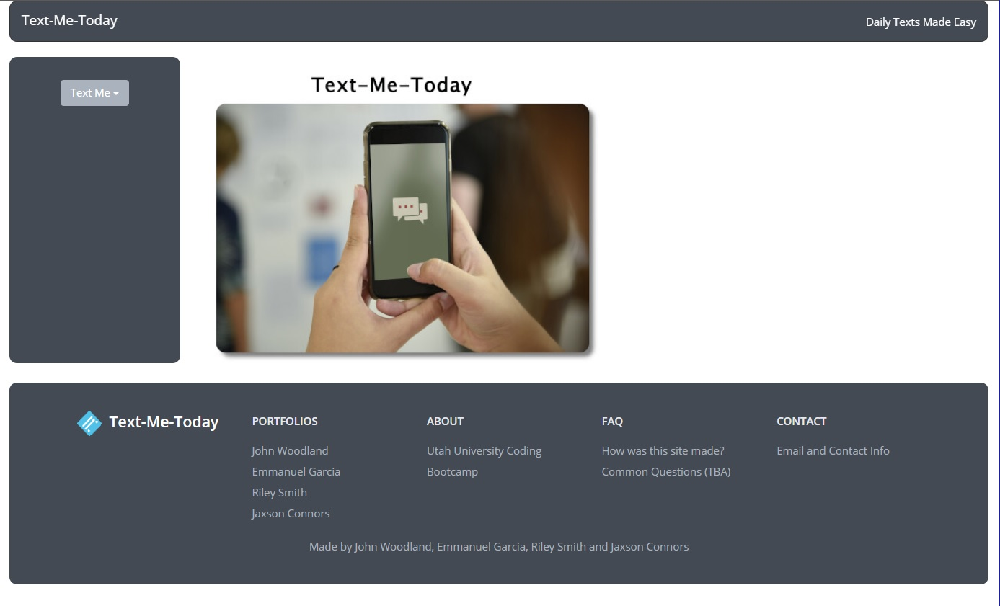

<!--
*** Thanks for checking out the Best-README-Template. If you have a suggestion
*** that would make this better, please fork the repo and create a pull request
*** or simply open an issue with the tag "enhancement".
*** Thanks again! Now go create something AMAZING! :D
***
***
***
*** To avoid retyping too much info. Do a search and replace for the following:
*** GarciaE89, text-me-today, twitter_handle, email, Text-Me-Today, project_description
-->

<!-- PROJECT SHIELDS -->
<!--
*** I'm using markdown "reference style" links for readability.
*** Reference links are enclosed in brackets [ ] instead of parentheses ( ).
*** See the bottom of this document for the declaration of the reference variables
*** for contributors-url, forks-url, etc. This is an optional, concise syntax you may use.
*** https://www.markdownguide.org/basic-syntax/#reference-style-links
-->

<!-- PROJECT LOGO -->
 

  <h1 align="center">Text-Me-Today</h1>

  

    In a world that has more cellphones than alarm clocks.  Use this handy app to automatically text yourself or others at specific times with daily appointments, the current weather or fun affirmations or quotes to start your day.
     
    <a href="https://github.com/GarciaE89/text-me-today"><strong>Explore the docs »</strong></a>
     
     
    <a href="https://github.com/GarciaE89/text-me-today">View Demo</a>
    ·
    <a href="https://github.com/GarciaE89/text-me-today/issues">Report Bug</a>
    ·
    <a href="https://github.com/GarciaE89/text-me-today/issues">Request Feature</a>
  

<!-- TABLE OF CONTENTS -->

  
<h2 style="display: inline-block">Table of Contents</h2>

  <ol>
    <li>
      <a href="#about-the-project">About The Project</a>
      <ul>
        <li><a href="#built-with">Built With</a></li>
      </ul>
    </li>
    <li><a href="#usage">Usage</a></li>
    <li><a href="#contact">Contact</a></li>
  </ol>

<!-- ABOUT THE PROJECT -->
## About The Project

### Built With

* HTML
* CSS - BootFlat
* Javascript
* [Openweathermap - For Weather](https://openweathermap.org/current)
* [Api.icndb.com - Chuck Norris Jokes](https://www.icndb.com/api/)
* [Dulce-affirmations-api - For daily affirmations](https://github.com/misselliev/affirmations-api)
* [Textbelt.com - For the texts sent out](https://textbelt.com/)

<!-- USAGE EXAMPLES -->
## Usage

* Click the 'Text Me' button at the top left for the dropdown menu.
* Click add text for the text menu.
* Choose the time, phone number and options you would like for your text.
* When the chosen time arrives this will automatically send the text to the specified number!

<!-- CONTACT -->
## Contact

John Woodland: 
* E-mail: johntaylorwoodland@gmail.com
* Portfolio: https://github.com/jondagamkd/portfolio

Jaxson Connors:
* Portfolio: https://github.com/JaxsonConnors/JaxsonConnors-ChallengePortfolio

Riley Smith:
* Portfolio: https://grsmith35.github.io/rsmithportfolio/

Emmanuel Garcia:
* Portfolio: https://garciae89.github.io

Project Link: [https://github.com/GarciaE89/text-me-today](https://github.com/GarciaE89/text-me-today)

<!-- MARKDOWN LINKS & IMAGES -->
<!-- https://www.markdownguide.org/basic-syntax/#reference-style-links -->
[contributors-shield]: https://img.shields.io/github/contributors/GarciaE89/repo.svg?style=for-the-badge
[contributors-url]: https://github.com/GarciaE89/text-me-today/graphs/contributors
[forks-shield]: https://img.shields.io/github/forks/GarciaE89/repo.svg?style=for-the-badge
[forks-url]: https://github.com/GarciaE89/text-me-today/network/members
[stars-shield]: https://img.shields.io/github/stars/GarciaE89/repo.svg?style=for-the-badge
[stars-url]: https://github.com/GarciaE89/text-me-today/stargazers
[issues-shield]: https://img.shields.io/github/issues/GarciaE89/repo.svg?style=for-the-badge
[issues-url]: https://github.com/GarciaE89/text-me-today/issues
[license-shield]: https://img.shields.io/github/license/GarciaE89/repo.svg?style=for-the-badge
[license-url]: https://github.com/GarciaE89/text-me-today/blob/master/LICENSE.txt
[linkedin-shield]: https://img.shields.io/badge/-LinkedIn-black.svg?style=for-the-badge&logo=linkedin&colorB=555
[linkedin-url]: https://linkedin.com/in/GarciaE89
